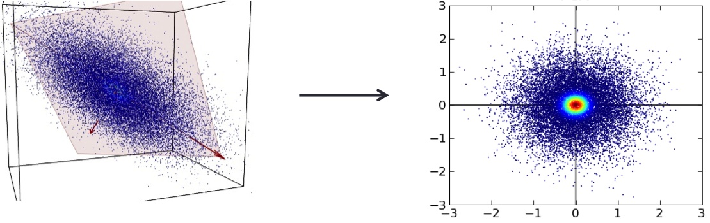
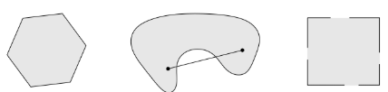

# 2.3 两种简单的预测方式：最小二乘和最近邻

| 原文 | The Elements of Statistical Learning |
| ---- | ------------------------------------ |
| 翻译 | szcf-weiya                           |
| 时间 | 2018-08-21                           |
| 解读 | Hytn Chen                            |
| 更新 | 2020-01-05                           |

在这一部分中我们讨论两种简单但很有用的预测方法：最小二乘法的线性模型拟合和 $k$-最近邻预测规则．线性模型对结构做出很大的假设而且得出稳定但可能不正确的预测．$k$-最近邻方法对结构的假设很温和：它的预测通常是准确的但不稳定．

## 线性模型和最小二乘

线性模型已经成为过去 $30$ 年统计学的支柱，而且仍然是我们最重要的工具．给定输入向量 $X^T=(X_1,X_2,\cdots,X_p)$，我们通过模型

$$
\hat{Y} = \hat{\beta}_0+\sum\limits_{j=1}^{p}X_j\hat{\beta}_j
\tag{2.1}
$$

来预测输出 $Y$．

$\hat{\beta}_0$ 是截距，也是机器学习中的 **偏差 (bias)**．经常为了方便起见把常数变量 $1$ 放进 $X$，把 $\hat{\beta}_0$ 放进系数变量 $\hat{\beta}$ 中，然后把用向量内积形式写出线性模型

$$
\hat{Y} = X^T\hat{\beta}
\tag{2.2}
$$

其中 $X^T$ 为向量或者矩阵的转置（$X$ 为列向量）．这里我们对单个输出的建立模型，所以 $\hat{Y}$ 为标量；一般地，$\hat{Y}$ 可以是一个 $K$ 维向量，这种情形下，$\beta$ 是一个 $p\times K$ 的系数矩阵．在 ==$(p+1)$ 维==输入输出空间中，$(X,\hat{Y})$ 表示一个==超平面==．如果常数项包含在 $X$ 中，则超平面过原点，而且是一个==子空间==；如果不是，则是一个过点 $(0,\hat{\beta}_0)$ 切 $Y$ 轴的==仿射集==．从现在起，我们假设截距项包含在 $\hat{\beta}$ 中．

在 $p$ 维输入空间从函数观点来看，$f(X)=X^T\beta$ 是线性的，其==梯度 $f'(X)=\beta$== 是输入空间里的最速上升方向的向量．

根据训练数据我们怎样拟合线性模型？有许多不同的方法，但目前为止最受欢迎的是最小二乘法．在这个方法里面，我们选取系数 $\beta$ 使得残差平方和最小:

$$
\rm{RSS}(\beta) = \sum_{i=1}^N(y_i-x_i^T\beta)^2
\tag{2.3}
$$

$\rm{RSS}(\beta)$ 是系数的二次函数，因此其最小值总是存在，但是可能不唯一．它的解用矩阵来表示是最简单的．我们可以写成

$$
\rm{RSS}(\beta) = (\rm{y}-\mathbf{X}\beta)^T(\rm{y}-\mathbf{X}\beta)
\tag{2.4}
$$

其中，$\mathbf{X}$ 是 $N\times p$ 矩阵，每一行是一个输入向量，$\mathbf{y}$ 是训练集里面的 $N$ 维输出向量．对 $\beta$ 微分我们有 **正规方程组 (normal equations)**

$$
\mathbf{X}^T(\mathbf{y}-\mathbf{X}\beta)=0
\tag{2.5}
$$

如果 $\mathbf{X}^T\mathbf{X}$ ==非奇异==，则唯一解为

$$
\hat{\beta}=(\mathbf{X}^T\mathbf{X})^{-1}\mathbf{X}^T\mathbf{y}
\tag{2.6}
$$

而且第 $i$ 个输入 $x_i$ 的拟合值为 $\hat{y}_i=\hat{y}(x_i)=x_i^T\hat{\beta}$．在任意输入 $x_0$ 处，预测值为 $\hat{y}(x_0)=x_0^T\hat{\beta}$．整个==拟合曲面==由 $\hat{\beta}$ 的 $p$ 个系数所决定．直观地，我们不需要非常多的数据集去拟合这样一个模型．

让我们来看线性模型在分类问题中的一个例子．图 2.1 显示了训练数据在一对输入 $X_1$ 和 $X_2$ 的散点图．数据是模拟的，而且现在模拟模型不是很重要．输出的类变量 $G$ 取值为蓝色或橘黄色，而且正如散点图表示的那样．每个类里面都有 $100$ 个点．线性回归模型是去拟合这些数据，蓝色时响应变量 $Y$ 编码为 $0$，橘黄色时编码为 $1$．拟合值 $\hat{Y}$ 根据下面规则转化为拟合的类变量 $\hat{G}$

$$
\hat{G}=
\left\{
\begin{array}{cc}
\color{orange}{ORANGE}\quad&\text{if }\hat{Y} > 0.5\\
\color{blue}{BLUE}\quad & \text{if }\hat{Y}\le 0.5
\end{array}
\right.
\tag{2.7}
$$

> 图 2.1：两维分类的例子．类别被编码为二进制变量（蓝色为 $0$，橘黄色为 $1$），然后通过线性回归进行拟合．图中直线是判别边界，直线方程为 $x^T\hat{\beta}=0.5$．橘黄色阴影区域表示这一部分输入区域被分成橘黄色，而蓝色阴影区域分成蓝色．

在 $\mathbf{R}^2$ 中被分成橘黄色类的点对应 $\\{x:x^T\hat{\beta}>0.5\\}$，如图 2.1 中显示的那样，而且两个预测的类被判别边界 $\\{x:x^T\hat{\beta}=0.5\\}$ 分隔开，在这种情形下是线性的．我们可以看到在判别边界的两边都有被分错的点．或许我们的线性模型太严格了，又或者是这些错误无法避免？记住这些是在训练数据本身上的错误，而且我们没有说这些构造的数据从哪里来的．考虑下面两种可能的情境：

**情境1：**每一类的训练数据是从二元正态分布（不相关且均值不同）中生成的．

**情境2：**每一类的训练数据是来自 $10$ 个低方差的高斯分布的混合，每一个高斯分布都有各自的均值．

就生成模型而言，混合的高斯分布是描述得最好的．首先产生一个离散随机变量，该变量决定使用哪个部分的高斯分布，然后根据选择的密度产生观测值．在每一类是一个高斯分布的情形下，我们将在第四章看到一个线性的判别边界是最好的，而且我们的估计也几乎是最优的．区域的重叠是不可避免的，而且将要被预测的数据因为数据重叠也会变得很麻烦．

在混合紧密聚集的高斯分布中情形不一样了．一个线性的判别边界不大可能是最优的，而且事实上也不是．最优的判别边界是非线性不相交的，而且作为这种判别边界，将会更难确定．

我们现在来看一下另一种分类和回归的过程，在某种程度上是与线性模型相反的一种做法，但却更好地能够适用第二种情形．

## 个人解读

**$(p+1)$维输入输出空间，超平面，子空间以及仿射集等高亮部分解读**：

很简单，$p$个输入$X$和一个输出$Y$构成了$ (p+1)$维的输入输出空间，**超平面**就是平面中的直线、空间中的平面之推广（只有维度大于3才被称为超平面）。超平面的法向量是：$(\hat{\beta}_1, \hat{\beta}_2, \cdots, \hat{\beta}_p, -1)$，$ \hat{\beta}_0$则代表超平面到原点的距离。其中[证明过程](https://blog.csdn.net/dengheCSDN/article/details/77313758)不再赘述，但是可以通过超平面的另一种定义感性理解其中原因：

给定向量空间$R^n$中的一个点$p$和一个非零向量$n$，满足：

$$
n*(i-p) = 0\notag
$$

则称点集$i$为通过点$p$的超平面，向量$n$为通过超平面的法向量。将此处法向量看作$(\hat{\beta}_1, \hat{\beta}_2, \cdots, \hat{\beta}_p, -1) $，从超平面上任取符合等式(2.1)的两个点，相减后，定义$S_j$作为：两个点在第$j$维上相减后的结果，即$X_{1j}-X_{2j}$。可得最终相减结果为$(S_1, S_2, \cdots, S_{p+1}) $。法向量乘以最终相减结果再展开后$\hat{\beta}_0$抵消，最终结果就是0。所以$(\hat{\beta}_1, \hat{\beta}_2, \cdots, \hat{\beta}_p, -1)$就是法向量。

而**子空间**的[定义](https://www.zhihu.com/question/48849797)则不再赘述，个人理解就类似集合子集的概念，定义里面主要就在声明作为原空间子集的子空间得是一个线性空间。

值得一提的是子空间在SVD上的应用，后面的章节会讲述到。这里先看看上面链接中的图供大家直观感受：

在上图中，蓝色的数据点近似分布在一个二维平面内，svd寻找到了表示这个二维平面的两个**基向量**，就是左图中红色的箭头，然后将数据点投影到这个平面内得到右图所示的数据点近似结果。

提供图的作者解释得很好：假如我们在三维空间内有一些离散分布的数据点，但是这些数据点近似分布在一个二维子平面内，可能有一些偏差，那么奇异值分解所做的就是寻找这个最佳的二维子平面，从而拟合三维空间的数据点分布。这种用子空间去拟合数据的方式实际上就是一般说的**线性拟合方法**。

关于**仿射集**相关[定义](https://www.jianshu.com/p/248be25393b7)不再多言，具体例子就有直线，平面与超平面。与其相关的概念还有凸集，其直观判断很简单，如下图所示：

任意找出两个点，判断两个点所组成的线段上是否有不在集合内的点即可，如果有就不是凸集。上图中右边两个都不是凸集。

**矩阵求导实际意义**：

对于都是$2*2$的矩阵$A, B, C$，若是矩阵C对于矩阵A求导，那么从标量的结果上来说就是C中的每一个元素，都要对于A中的每一个元素进行求导。因此会出现16个导数结果，这16个结果如何排列都是按需自取。

上面只是一个简单的例子，若讨论$Y$关于$X$的导数的话，需要分类讨论两者各自是矩阵，向量或者标量的情况。有些学者在自己的[学习笔记](https://blog.csdn.net/u010976453/article/details/54381248)中讨论得很详尽。值得一提的是，向量关于向量的导数获得的矩阵就叫做**Jacobian**矩阵，而标量$y$对矩阵$X$的导数就是梯度矩阵，可以表示为下式：
$$
\frac{\partial y}{\partial \mathbf{X}}=\left[\begin{array}{cccc}
{\frac{\partial y}{\partial x_{11}}} & {\frac{\partial y}{\partial x_{21}}} & {\cdots} & {\frac{\partial y}{\partial x_{n 1}}} \\
{\frac{\partial y}{\partial x_{12}}} & {\frac{\partial y}{\partial x_{22}}} & {\cdots} & {\frac{\partial y}{\partial x_{n 2}}} \\
{\vdots} & {\vdots} & {\ddots} & {\vdots} \\
{\frac{\partial y}{\partial x_{1 n}}} & {\frac{\partial y}{\partial x_{2 n}}} & {\cdots} & {\frac{\partial y}{\partial x_{n n}}}
\end{array}\right]\notag
$$
上文中所求得的梯度 $f'(X)=\beta$应当就是标量$y$对向量$X$进行求导，所以得出来的结果只有一行$\beta$，是向量的形式。

有关矩阵求导的实际运算法则在[矩阵求导术](https://zhuanlan.zhihu.com/p/24709748)这篇文章中写得很详尽，可依据具体运算法则进行操作，机器学习中设计的矩阵求导根据如下表所示运算法则基本都可进行计算：

例如原始的等式是：
$$
\rm{RSS}(\beta) = (\rm{y}-\mathbf{X}\beta)^T(\rm{y}-\mathbf{X}\beta)\tag{2.4}\notag
$$

将等式右边展开后，可得：
$$
\rm{RSS}(\beta) = \rm{y}^T\rm{y} - \rm{y}^T\mathbf{X}\beta - \beta^T\mathbf{X}\rm{y} + \beta^T\mathbf{X}^T\mathbf{X}\beta\notag
$$

接下来就可以根据上表的运算法则对$\beta$逐项进行求偏导了，值得一提的是上式等式右边的第四项$\beta^T\mathbf{X}^T\mathbf{X}\beta$，对于该项求导的过程需要知道如下概念，首先把$X\beta$当作$y$，先对$y$求导再对$\beta$求导，这里就涉及矩阵求导的链式法则：

已知$y = Ax$，则$\frac{\partial f}{\partial y} = (\frac{\partial y}{\partial x})^T(\frac{\partial f}{\partial y})$。

该结论的推导过程如下图所示：

根据上面的规则对所有项全部完成求导之后，可得到最终结果：

$$
\frac{\partial f(\beta)}{\partial \beta} = -2X^Ty + 2X^TX\beta = 0\notag
$$

即：
$$
\mathbf{X}^T(\mathbf{y}-\mathbf{X}\beta)=0\notag
$$

对于残差平方和$RSS$求得矩阵表达式下的结果后，如果有解需要有前提条件就是$\mathbf{X}^T\mathbf{X}$要满足**非奇异**。在此讨论一下非奇异是什么以及为什么需要非奇异。

首先必须要是非奇异的矩阵才是可逆矩阵，这样$(X^TX)^{-1}$才成立。

接下来讨论**非奇异**的概念：

非奇异一定是**可逆矩阵**，而可逆矩阵一定是方阵，也一定**满秩**（既是行满秩也是列满秩），反之，满秩的方阵也一定是可逆矩阵，就像$X^TX$的结果一定是一个方阵，这才可以讨论其可逆性。不可逆矩阵也就是**奇异阵**要么不是方阵，要么就是方阵但是不满秩。那么什么是满秩？

首先秩是图像经过矩阵变换之后的空间维度，同时秩也是列空间的维度（列空间的秩等于行空间的秩，所以只看一个就可以了）。对一个方阵来说，满秩就代表每个列向量都线性无关（行向量也线性无关，因为最后通过线性变换都可以变成是单位矩阵的形式，单位矩阵行也是线性无关的）。

如果一个方阵满秩，那么其行列式一定不等于0，这两个互为充要条件，有关[行列式的本质](https://www.zhihu.com/question/36966326/answer/162550802)以及[如何理解矩阵的秩](https://www.zhihu.com/question/21605094)可以自行拓展阅读。

## 最邻近方法

最邻近方法用训练集 $\mathcal{T}$ 中在输入空间中离 $x$ 最近的观测组成 $\hat{Y}$．特别地，对 $\hat{Y}$ 的 $k$-最近邻拟合定义如下：

$$
\hat{Y}(x)=\frac{1}{k}\sum\limits_{x_i\in N_k(x)}y_i\tag{2.8}
$$

$N_k(x)$ 是在训练样本中 $k$ 个离 $x$ 最近的点 $x_i$ 组成的邻域．远近意味着度量，目前我们假设是欧氏距离．因此，用文字来叙述就是，我们在输入空间中找到离 $x$ 最近的 $k$ 个观测 $x_i$，然后取这些值的平均．

在图 2.2 中我们采用图 2.1 中同样的训练数据，然后采用 $15$-最近邻平均二进制编码作为拟合的方法．因此 $\hat{Y}$ 是橘黄色在邻域中的比例，然后如果 $\hat{Y} > 0.5$ 在邻域中的数量占了主要部分则将橘黄色的类赋值给 $\hat{G}$．有颜色的区域表明该区域里面的点根据这一条规则分成了橘黄色和蓝色，这种情形下是靠对网格上的点进行赋值找到的．我们可以看到分开蓝色和橘黄色的判别边界更加地不规则，而且对应于某一类所主导的局部聚集．

> 图 2.2 图 2.1 中一样的二维分类的例子．类别被二进制变量编码（蓝色为 $0$，橘黄色为 $1$），通过 $15$-最近邻平均拟合．因此预测的类别是选择 $15$-最近邻中占大部分的类别．

图 2.3 显示了 $1$-最近邻的分类结果：$\hat{Y}$ 被赋了距离 $x$ 的最近点 $x_{\ell}$ 的值 $y_{\ell}$．这种情形下，区域的分类可以相对简单的计算出来，这对应训练数据的 **泰森多边形图 (Voronoi tessellation)**．每个点 $x_i$ 都有一个对应的区域，这些小区域形成了离某点最近的区域．对于小区域里面的每一个点，$\hat{G}(x)=g_i$．判别边界比之前更加不规则了．

图 2.1 中一样的二维分类的例子．类别被二进制变量编码（蓝色为 $0$，橘黄色为 $1$），通过 $1$-最近邻分类预测．

$k$-最近邻平均的方法以与定量输出 $Y$ 的回归完全相同的方式定义，尽管 $k=1$ 是不太可能的选择．

相比较图 2.1，在图 2.2 中更少的训练观测值被错误地分类．尽管如此，这个不应该给我们太大的安慰，因为图 2.3 中没有一个训练数据被错误地分类．一个小小的想法表明在 $k$-最近邻拟合中，训练数据的误差应该近似是关于 $k$ 的增函数，而且当 $k=1$ 时误差总是为 $0$．一个独立的测试集比较这些不同的方法会给我们一个满意的方法．

看起来 $k$-最近邻拟合只有一个参数，$k$ 值的大小，而在最小二乘有 $p$ 个参数．尽管情况就是这样，我们将会看到 $k$-最近邻的 ==**有效(effective)** 参数==个数是 $\frac{N}{k}$，而且一般地会比 $p$ 大，另外随着 $k$ 的增长有效参数个数减少．为了弄清楚为什么，注意到如果邻域没有==重叠==，则会有 $\frac{N}{k}$ 个邻域，而且我们在每个区域内拟合一个参数．

我们不能在训练集上将误差平方和作为选择 $k$ 的标准，因为我们总会选择 $k=1$．$k$-最近邻方法对于上文中描述的情境 $2$ 更适合，尽管对于高斯分布的数据 $k$-最近邻判别边界会有不必要的噪声．

## 从最小二乘到最近邻

最小二乘法的线性判别边界非常光滑，而且显然拟合得很稳定．它似乎严重依赖线性判别边界是合理的假设．我们马上用文字讨论，它有低方差和潜在的高偏差．

另一方面，$k$-最近邻过程似乎不非常依赖任何关于数据的假设，而且可以适用于任何情形．然而，判别边界的任何特定的分区都依赖几个输入点和它们的特定位置，而且因此左右摇摆不稳定——高方差和低偏差．

每种方法都有各自处理得最好的情形；特别地，线性回归更适合上面介绍的情形 $1$，而最邻近方法最适合情形 $2$．是来揭露困难的时候了．事实上数据是从介于两种情形的模型中模拟出来的，但是更接近于情形 $2$．首先，我们从双变量高斯分布 $N((1,0)^T,\bf{I})$ 中产生 $10$ 个均值 $m_k$，标记此类为蓝色．类似地，从双变量高斯分布 $N((0,1)^T,\bf{I})$ 中产生 $10$ 个均值并标记此类为橘黄色．然后对每一类按照下面方式产生 $100$ 个观测：对于每个观测，我们以 $1/10$ 的概率随机选择一个 $m_k$，然后产生 $N(m_k,\bf{I}/5)$，因此对于每一类引出了一个高斯分布簇的混合．图 2.4 显示了从该模型产生 $10000$ 个新观测的的分类结果，我们比较最小二乘法和一系列 $k$ 值对应的 $k$-最近邻的结果．

> 图 2.4：在图 2.1，图 2.2，图 2.3 中运用的模拟例子的错误分类曲线．我们用的是 $200$ 个样本作为训练数据，检测数据规模为 $10000$个．橘黄色的曲线对应 $k$-最近邻分类的测试数据，蓝色的曲线对应 $k$-最近邻分类的训练数据．线性回归的结果是在自由度为 $3$ 上的大橘黄色和蓝色的方块．紫色的直线是最优的贝叶斯错误率．

今天最受欢迎的技巧的一大部分是这两种方法的变形．事实上，$1$-最近邻，所有方法中最简单的，夺取了低维问题的大部分市场．下面列举描述了这些简单的过程增强的方式

- ==核方法==用光滑递减至 $0$ 的权重及距离目标点的距离，而不是像在$k$-最近邻中用的有效的 $0/1$ 权重系数
- 高维空间中，距离核修改成比其它的变量更多地==强调某些变量==
- 通过==局部权重的最小二乘的局部线性回归==，而不是局部用常数值来拟合
- 线性模型适应基本的允许任意复杂模型的==原始输入的拓展==
- ==投影寻踪==和==神经网络模型==包括非线性模型转换为线性模型之和

## 个人解读

$K$近邻的另一种直观的理解是，将待分类的点看作圆心，慢慢扩大圆的半径慢慢包括进越来越多的训练样本，直到包括进来$K$个训练样本为止，这时候对这$K$个训练样本进行统计，哪一类占的数量多就将样本点的标签打为哪一类。这应该是也是原文中平均二进制编码的意思，二分类问题如果是第一类就是1，是第二类就是0，一共$K$位二进制编码。

当$K=1$的时候误差为0，没有样本被错误分类，注意K近邻法的本质就是：利用训练数据集对特征向量空间进行划分，并作为其分类的model。如果$K=1$，这样得出的model（划分方案）显然会过拟合。

那么为什么K近邻的有效参数个数是 $\frac{N}{k}$呢？因为在邻域不重合的情况下，整个空间会被划分成$\frac{N}{k}$个区域，因此最终的分类结果就会由这$\frac{N}{k}$个因素来决定，所以有效参数个数是$\frac{N}{k}$。

