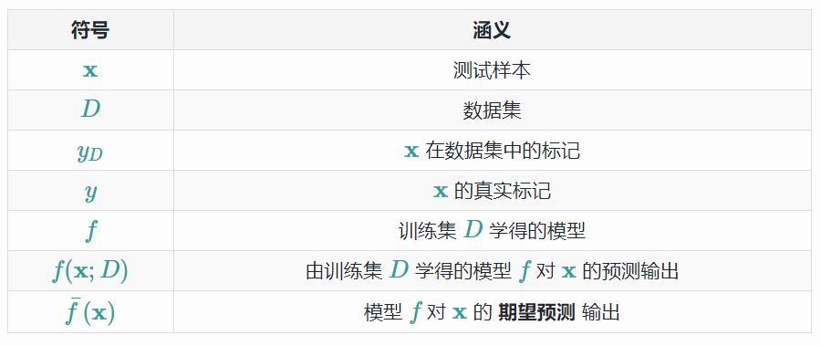
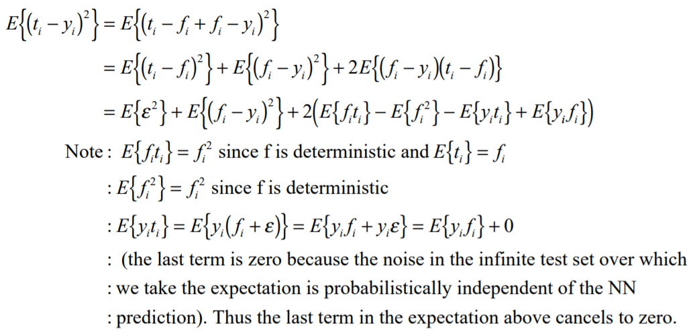

# 2.5 高维问题的局部方法

| 原文 | The Elements of Statistical Learning |
| :--: | :----------------------------------: |
| 翻译 |              szcf-weiya              |
| 时间 |              2018-08-21              |
| 解读 |              Hytn Chen               |
| 更新 |              2020-02-01              |

## 翻译原文

至今为止我们已经仔细讨论了两个关于预测的学习方法：稳定但是有偏差的线性模型和不稳定但显然偏差较小的 $k$-最近邻估计．当有充分大的训练数据，我们似乎总会选择 $k$-最近邻平均来近似理论上的最优条件期望，因为我们能够找到一个相当大的离 $x$ 近的观测构成的邻域并且平均里面的观测值．在高维情形下这种方法以及我们的直觉都没有用，而且这种现象通常被称作 **维度的诅咒 (curse of dimensionality)** (Bellman, 1961[^1])．关于这个问题有很多的证明，我们将要仔细讨论一些．

!!! note "weiya 注:"
    查阅[维基百科](https://zh.wikipedia.org/wiki/%E7%BB%B4%E6%95%B0%E7%81%BE%E9%9A%BE)，“curse of dimensionality” 可以翻译成 **维数灾难** 或 **维度的诅咒**．

[^1]: Bellman, R. E. (1961). Adaptive Control Processes, Princeton University Press.

正如图 2.6 显示的那样，我们考虑输入在 $p$ 维单位超立方体均匀分布的最近邻过程．假设我们在某个目标点构造超立方体的邻域来捕获观测值的一个小部分 $r$．因为这个邻域对应单位体积的比例 $r$，则边长的期望值为 $e_p(r)=r^{1/p}$．在 $10$ 维空间下 $e_{10}(0.01)=0.63$,$e_{10}(0.1)=0.80$，而每个输入的全部范围为 $1.0$．所以选取 $1\%$ 或 $10\%$ 的数据去形成局部均值，我们必须在每个输入变量上覆盖到 $63\%$ 或者 $80\%$．这样的邻域不再是局部的．显著地降低 $r$ 并没有作用，因为我们选取去==平均的观测值==越少，我们拟合的方差也会越大．

> 图 2.6:一个输入为均匀分布数据的单位立方体的子立方体邻域, 它很好地展现出了维数的灾难．右边的图显示了不同维数 $p$ 下，为了捕捉一小部分的数据 $r$，子立方体的所需要的边长．在 $10$ 维的情况下，为了捕捉 $10\%$ 的数据，我们需要包括每个坐标取值范围的 $80\%$．

高维下的稀疏取样的另外一个后果是所有的样本点离样本的某一边很近．考虑在 $p$ 维以原点为中心的单位球中均匀分布的 $N$ 个数据点．假设我们考虑原点处的最近邻估计．距离原点最近的数据点距离的中位数由下式给出（[练习 2.3](https://github.com/szcf-weiya/ESL-CN/issues/60)）

$$
d(p,N)=(1-(\frac{1}{2})^{1/N})^{1/p}\tag{2.24}
$$

!!! note "weiya 注"
    我们可以这样得到(2.24)式：
    将数据点与原点的距离看成随机变量$X$，因为数据点均匀分布，则 $X$ 的分布函数为
    $$
    F(X < x)=x^p, \; x\in [0,1]
    $$
    则最近距离为次序统计量$X_{(1)}$，其分布函数为
    $$
    F_1(x)=1-(1-F(x))^N
    $$
    最近距离的中位数满足 $F_1(d(p,N))=\frac{1}{2}$，于是可以得到(2.24)式．

距离原点最近的数据点的距离的均值表达式更加复杂．当 $N=500,p=10,d(p,N)\approx 0.52$，比到边界的距离的一半还要大．因此大部分的数据点离样本空间的边界比其他任何的数据点更近．这里产生问题的原因是对于训练样本中靠近的边的预测更加困难．一定要从样本点的邻域外推而不是在中间插入．

另外一个证明这个灾难是取样密度是跟 $N^{1/p}$ 成比例，其中 $p$ 为输入空间的维数，$N$ 为样本的规模．因此，如果 $N_1=100$ 表示对于单输入问题的大密度取样，然后 $N_{10}=100^{10}$ 是 $10$ 个输入时取样密度同上面相同时所需要的样本规模大小．因此在==高维空间中所有可行的训练样本在输入空间中很稀少==．

让我们构造另一个均匀分布的例子．假设我们有从 $[-1,1]^p$ 中均匀产生的 $1000$ 个训练样本 $x_i$．假设==没有任何测量错误==，$X$ 和 $Y$ 之间真正的关系是

$$
Y = f(X) = e^{−8\mid \mid X\mid \mid ^2},
$$

我们采用 $1$-最近邻规则去预测测试点 $x_0=0$ 的值 $y_0$．记训练集为 ${\cal{T}}$．对于我们的过程，可以通过平均所有的大小为 $1000$ 的样本来计算在 $x_0$ 处的预测偏差的期望值．因为这个问题是确定性的，下面是估计 $f(0)$ 的均方误差 $\rm{MSE}$

$$
\begin{align*}
\rm{MSE}(x_0)&=\rm{E}_{\cal{T}}[f(x_0)-\hat{y}_0]^2\notag\\
&=\rm{E}_{\cal{T}}[\hat{y}_0-E_{\cal{T}}(\hat{y}_0)]^2+[\rm{E}_{\cal T}(\hat y_0)-f(x_0)]^2\notag\\
&=\rm{Var}_{\cal{T}}(\hat{y}_0)+Bias^2(\hat{y}_0)\tag{2.25}
\end{align*}
$$

图 2.7 显示了这个设定．我们已经把 $\rm{MSE}$ 分解成两个部分，随着我们继续讨论，会越来越熟悉这两个部分，这两部分分别是方差和偏差平方．这一分解总是可行的的而且经常有用，并且这一分解被称为 **偏差-方差分解 (bias-variance decomposition)**．除非最近邻在 $0$ 处，这一例子中 $\hat{y}_0$ 会比 $f(0)$ 小，而且平均估计会向下偏．方差是因为 $1$-最近邻取样的方差．在低维度以及 $N=1000$ 情况下，最近邻非常接近 $0$，于是偏差和方差都会非常小．当维数增大，最近邻有从目标点远离的趋势，而且都会带来偏差跟方差．$p=10$ 时，超过 $99\%$ 的样本的最近邻距离原点大于 $0.5$．因此，当 $p$ 增长时，估计值多半有趋势趋于 $0$，因此 $\rm{MSE}$ 保持在 $1.0$ 附近，偏差也是如此，方差开始下降（这个例子的衍生）．

> 图 2.7：一个模拟的例子，证明维数的灾难以及其在 $\rm{MSE}$，偏差和方差的影响．输入的特征在 $[-1,1]^p,p=1,\ldots,10$ 上均匀分布．左上角显示了在 $\rm{IR}$ 上的目标函数（无噪声）：$f(X)=e^{-8\mid \mid X\mid \mid ^2}$，而且展示了 $1$-最近邻在估计 $f(0)$ 时的误差．训练点用蓝色的记号表示．右上角显示了为什么 $1$-最近邻的半径随着维数 $p$ 的增加而增加．左下角显示了 $1$-最近邻的平均半径．右下角显示了 $\rm{MSE}$，偏差平方和方差关于维数 $p$ 的函数曲线．

> 本章不同于2.5节从最小二乘的角度解读泛化误差，而是采用k近邻的方法代入泛化误差公式，最后解读出k近邻情况下的诸多结论，而这些结论其实代表了一种普遍现象，对其他的模型结论亦是如此。

尽管这是一个非常不自然的例子，类型的情形发生的更一般．多变量的函数复杂度随着维数呈指数增长，而且如果我们希望以在低维中以相同的精度来估计高维中的函数，我们将会需要呈指数增长规模的训练集．在这个例子中，函数是所有 $p$ 个变量参与的复杂交互．

偏差项关于距离的依赖性取决于真实值，而且在 $1$-最近邻情况它并不总是占主要部分．举个例子，如果像图 2.8 一样函数总是仅仅与少量的维度有关，方差便会占主要部分． 

另一方面假设我们知道 $Y$ 与 $X$ 之间的关系为线性的

$$
Y = X^T\beta + \varepsilon\tag{2.26}
$$

其中 $\varepsilon \sim N(0,\sigma^2)$，而且我们用最小二乘对训练数据进行拟合模型．对于任意测试点 $x_0$，我们有 $\hat y_0=x_0^T\hat{\beta}$，可以写成 $\hat y_0=x_0^T\beta+\sum_{i=1}^N\ell_i(x_0)\epsilon_i$，其中 $\ell_i(x_0)$ 是 ${\mathbf{X(X^TX)}}^{-1}x_0$ 的第 $i$ 个元素．因为在这个模型下，最小二乘估计是==无偏==的，我们发现

$$
\begin{align}
\rm{EPE}(x_0) &= \rm{E}_{y_0\mid x_0}\rm{E}_{{\cal T}}(y_0-\hat{y}_0)^2\\
&={\color{red} {\rm{E}_{y_0\mid x_0}\rm{E}_{\cal T}(x_0^T\beta+\varepsilon-\hat{y}_0)^2}}\\
&={\color{red} {\rm{E}_{y_0\mid x_0}\rm{E}_{\cal T}[(x_0^T\beta-\hat{y}_0)^2+2\varepsilon (x_0^T\beta-\hat{y}_0)+\varepsilon ^2]}}\\
&={\color{red} {\rm{E}_{y_0\mid x_0}\varepsilon ^2+\rm{E}_{\cal T}(x_0^T\beta-\hat{y}_0)^2\qquad\qquad \because \rm{E}_{y_0\mid x_0}\varepsilon = 0}}\\
&=\rm{Var}(y_0\mid x_0)+\rm{E}_{\cal T}[\hat{y}_0-\rm{E}_{\cal T}\hat{y}_0]^2+[\rm{E}_{\cal T}\hat{y}_0-x_0^T\beta]^2\\
&=\rm{Var}(y_0\mid x_0)+\rm{Var}_{\cal T}(\hat{y}_0)+\rm{Bias}^2(\hat{y}_0)\\
&=\sigma^2+E_{\cal T}x_0^T(\mathbf{X^TX})^{-1}x_0\sigma^2+0^2\qquad\qquad\tag{2.27}
\end{align}
$$

因为我们的目标不是确定的，所以在预测误差中带来了一个附加的方差$\sigma^2$．没有偏差，而且方差依赖于 $x_0$．如果 $N$ 较大且 $\cal{T}$ 随机选取，并且假设 $\rm{E}(X)=0$，则 $\mathbf{X}^T\mathbf{X}\longrightarrow N\rm{Cov}(X)$，并且

$$
\begin{align*}
\rm{E}_{x_0}\rm{EPE}(x_0)&\sim \rm{E}_{x_0}x_0^T\rm{Cov}(X)^{-1}x_0\sigma^2/N+\sigma^2\notag\\
&=\rm{trace}[\rm{Cov}(X)^{-1}\rm{Cov}(x_0)]\sigma^2/N+\sigma^2\notag\\
&=\sigma^2(p/N)+\sigma^2\qquad\qquad\tag{2.28}
\end{align*}
$$

我们可以看到 $\rm{EPE}$ 的期望作为 $p$ 的函数线性增长，斜率 $\sigma^2/N$．如果 $N$ 大且/或 $\sigma^2$ 小，方差的增长可以忽略（在确定情形下为 $0$）．通过在拟合的模型的类别上插入一些强的限制，我们避免了维数的灾难．一些技巧细节在式 $(2.27)$ 和 $(2.28)$ 中，这也是源自[练习 2.5](https://github.com/szcf-weiya/ESL-CN/issues/160)．

!!! info "Ex. 2.5"
    已解决，详见 [Issue 160: Ex. 2.5](https://github.com/szcf-weiya/ESL-CN/issues/160).

图 2.9 在两种情形下比较 $1$-最近邻和最小二乘法，两种情形下形式均为 $Y=f(X)+\epsilon$，$X$ 和前面一样都是均匀分布的，而且$\epsilon\sim N(0,1)$．样本规模为 $N=500$．对于橙色曲线，$f(X)$ 关于第一个坐标是线性的，对于蓝色曲线，如图 2.8 中的立方．图中显示了相对于最小二乘而言，$1$-最近邻的相对 $\rm{EPE}$ 值．线性情况下大概是从 $2$ 开始．在这个情况下最小二乘是无偏的，而且上述讨论的 $\rm{EPE}$ 略高于 $\sigma^2=1$．$1$-最近邻的 $\rm{EPE}$ 总是大于 $2$，因为这种情形下 $\hat{f}_0$ 至少是 $\sigma^2$，而且随着维数增长比率增加，因为随着维数增加最近邻会远离目标点．对于立方体的情形，最小二乘是有偏的，使比率变得缓和．显然我们可以构造最小二乘的偏差主导方差的例子，然后 $1$-最近邻就会变成胜利者．

通过依赖严格的假设，线性模型没有偏差而且方差几乎可以忽略，然后 $1$-最近邻的误差就会相当的大．然而，如果假设是错误的，所有的东西都不复存在，而 $1$-最近邻将占主导地位．我们将会看到介于严格的线性模型和非常灵活的 $1$-最近邻模型之间的模型谱，每个都有它们各自的假设和偏差，这些假设已经具体提到过，通过在很大程度上借鉴这些假设来避免高维下函数复杂度呈指数增长．

在我们更加细致地探究下去之前，我们在统计模型的概念上进行详细说明，并且看一下他们怎么适应预测的框架．

## 个人解读

### 高维度带来的两个问题

最近邻法在高维中进行邻域的选择，邻域将不再是局部的，显著缩减邻域大小将导致平均观测值减少，方差增大。

所有选取得到的样本点离样本的某一边很近。

作者对该两个问题都进行了证明，其中对第二个问题的证明公式(2.24)较为抽象，更加详细的证明可参考博客[高维空间中的球体](https://www.cnblogs.com/boostable/p/iage_high_space_sphere.html)，其中详细证明了为什么高维空间中球体的体积大多集中在表面上，由此可更加解释公式(2.24)得出的结论。

总结一下，最通俗的理解高维空间带来的问题就是：高维空间中所有可行的训练样本在输入空间中很稀少。

### 泛化误差分解

ESL2.5原文中讨论了均方误差如何进行偏差-方差分解，而该篇博文[泛化误差与偏差、方差、噪声之间的关系](http://liuchengxu.org/blog-cn/posts/bias-variance/)则讨论得更加易于感性理解，摘出其中部分段落，其中泛化误差分解部分和原文公式(2.27)相同，首先变量声明如下：

#### 泛化误差

以回归任务为例, 学习算法的平方预测误差期望为：
$$
\operatorname{Err}(\mathbf{x})=E\left[(y-f(\mathbf{x} ; D))^{2}\right]
$$

#### 方差

在一个训练集$D$上模型f对测试样本$x$的预测输出为$f(x;D)$, 那么学习算法f对测试样本$x$的 **期望预测** 为：
$$
\bar{f}(\mathbf{x})=E_{D}[f(\mathbf{x} ; D)]
$$
上面的期望预测也就是针对**不同**数据集$D$, $f$对$x$的预测值取其期望, 也被叫做average predicted[2](http://liuchengxu.org/blog-cn/posts/bias-variance/#fn:1).

使用样本数相同的不同训练集产生的方差为:
$$
\operatorname{var}(\mathbf{x})=E_{D}\left[(f(\mathbf{x} ; D)-\bar{f}(\mathbf{x}))^{2}\right]
$$

#### 噪声

噪声为真实标记与数据集中的实际标记间的偏差：
$$
\epsilon^{2}=E_{D}\left[\left(y_{D}-y\right)^{2}\right]
$$

#### 偏差

期望预测与真实标记的误差称为偏差，为了方便起见，我们直接取偏差的平方：
$$
\operatorname{bias}^{2}(\mathrm{x})=(\bar{f}(\mathrm{x})-y)^{2}
$$

#### 泛化误差分解

那么对于某个算法的期望泛化误差进行分解的话：
$$
\begin{aligned}
E(f ; D)=& \mathbb{E}_{D}\left[\left(f(\boldsymbol{x} ; D)-y_{D}\right)^{2}\right] \\
=& \mathbb{E}_{D}\left[\left(f(\boldsymbol{x} ; D)-\bar{f}(\boldsymbol{x})+\bar{f}(\boldsymbol{x})-y_{D}\right)^{2}\right] \\
=& \mathbb{E}_{D}\left[(f(\boldsymbol{x} ; D)-\bar{f}(\boldsymbol{x}))^{2}\right]+\mathbb{E}_{D}\left[\left(\bar{f}(\boldsymbol{x})-y_{D}\right)^{2}\right] +\mathbb{E}_{D}\left[2(f(\boldsymbol{x} ; D)-\bar{f}(\boldsymbol{x}))\left(\bar{f}(\boldsymbol{x})-y_{D}\right)\right]\\
=&\mathbb{E}_{D}\left[(f(\boldsymbol{x} ; D)-\bar{f}(\boldsymbol{x}))^{2}\right]+\mathbb{E}_{D}\left[\left(\bar{f}(\boldsymbol{x})-y_{D}\right)^{2}\right]\\
=&\mathbb{E}_{D}\left[(f(\boldsymbol{x} ; D)-\bar{f}(\boldsymbol{x}))^{2}\right]+\mathbb{E}_{D}\left[\left(\bar{f}(\boldsymbol{x})-y+y-y_{D}\right)^{2}\right]\\
=&\mathbb{E}_{D}\left[(f(\boldsymbol{x} ; D)-\bar{f}(\boldsymbol{x}))^{2}\right]+\mathbb{E}_{D}\left[(\bar{f}(\boldsymbol{x})-y)^{2}\right]+\mathbb{E}_{D}\left[\left(y-y_{D}\right)^{2}\right]+2 \mathbb{E}_{D}\left[(\bar{f}(\boldsymbol{x})-y)\left(y-y_{D}\right)\right]\\
=&\mathbb{E}_{D}\left[(f(\boldsymbol{x} ; D)-\bar{f}(\boldsymbol{x}))^{2}\right]+(\bar{f}(\boldsymbol{x})-y)^{2}+\mathbb{E}_{D}\left[\left(y-y_{D}\right)^{2}\right]
\end{aligned}
$$
最后的分解结果中，左边项是方差，中间项是偏差，右边项是噪声。值得注意是，原博客省略了第三行的第三项结果等于0的推导证明过程，本人在[The Bias-Variance Tradeoff](http://www.inf.ed.ac.uk/teaching/courses/mlsc/Notes/Lecture4/BiasVariance.pdf)这篇文章中找到了详细证明过程如下（符合书中公式符号表达的证明过程见后文）：

#### 偏差，方差与噪声含义

- 偏差

  偏差度量了学习算法的期望预测与真实结果的偏离程序, 即**刻画了学习算法本身的拟合能力** .

- 方差

  方差度量了同样大小的训练集的变动所导致的学习性能的变化, 即**刻画了数据扰动所造成的影响** .

- 噪声

  噪声表达了在当前任务上任何学习算法所能达到的期望泛化误差的下界, 即**刻画了学习问题本身的难度** . （garbage in，garbage out）

想当然地, 我们希望偏差与方差越小越好, 但实际并非如此. 一般来说, 偏差与方差是有冲突的, 称为偏差-方差窘境 (bias-variance dilemma).

- 给定一个学习任务, 在训练初期, 由于训练不足, 学习器的拟合能力不够强, 偏差比较大, 也是由于拟合能力不强, 数据集的扰动也无法使学习器产生显著变化, 也就是欠拟合的情况;

- 随着训练程度的加深, 学习器的拟合能力逐渐增强, 训练数据的扰动也能够渐渐被学习器学到;

- 充分训练后, 学习器的拟合能力已非常强, 训练数据的轻微扰动都会导致学习器发生显著变化, 当训练数据自身的、非全局的特性被学习器学到了, 则将发生过拟合.

泛化误差部分拓展阅读结束，继续看原文。

书中对MSE进行了偏差-方差分解，公式如下：

$$
\begin{align}
\rm{MSE}(x_0)&=\rm{E}_{\cal{T}}[f(x_0)-\hat{y}_0]^2\notag\\
&=\rm{E}_{\cal{T}}[\hat{y}_0-E_{\cal{T}}(\hat{y}_0)]^2+[\rm{E}_{\cal T}(\hat y_0)-f(x_0)]^2\notag\\
&=\rm{Var}_{\cal{T}}(\hat{y}_0)+Bias^2(\hat{y}_0)
\end{align}
$$

本人理解方差就是模型在不同数据集上的表现与平均表现的差异；而偏差就是模型的平均表现与真实结果之间的差异。

### 图中得出的几个重要结论

原文中随后的几幅图都各自阐述或印证了很重要的一些结论，例如：

**$1$-最近邻的半径会随着维数 $p$ 的增加而增加**，其原因就是，从图2.7右上角的对比图可看出，除非一维中最近的点正好在$x_2=0$的线上，否则二维的半径一定比一维要大；还有**1-最近邻的均方误差（其实是偏差bias）会随着维度的增加而变大**，主要变大的是偏差项而不是方差项。偏差之所以会变大有几种解释，在开头已经说明，在此再总结一下：

高维空间中的点都集中在边界，这会使得预测更加困难，如果要用最近邻则必须用从邻域外推的方法而不是划定区域来插入点的方法；

高位空间中所有可行的样本点在输入空间很稀少，就会导致预测不准，也就是所谓的偏差增大。

高维空间的MSE也并不都是偏差占主导的，图2.8例举了一种情况，在这种情况下最后的MSE值也是越来越大，但是以方差占主导，偏差基本没有很大变化。如果**函数总是仅仅与少量的维度有关，方差便会占主要部分**。

### 从公式的角度看重要结论

那么有没有数学公式可以详细刻画偏差与方差对于MSE的期望值，也就是EPE的影响呢？

有的，公式(2.27)和(2.28)都进行了详细的刻画，公式所指导的结论非常重要，推导过程也值得探究。公式**(2.27)**的推导过程可参考泛化误差分解部分的推导，其中包含[无偏估计](https://blog.csdn.net/varyshare/article/details/89887059)的概念，现给出符合书中公式的推导过程如下，推导之前先明确如下关系：
$$
\mathrm{E}_{y_{0} | x_{0}} \mathrm{E}_{\mathcal{T}}=\mathrm{E}_{\mathcal{T}} \mathrm{E}_{y_{0} | x_{0}}
$$
同样的
$$
\mathrm{E}_{\mathcal{T}}=\mathrm{E}_{\mathcal{X}} \mathrm{E}_{\mathcal{Y} | \mathcal{X}}
$$
那么
$$
\begin{aligned}
E P E\left(x_{0}\right) &=E_{y_{0} | x_{0}} E_{T}\left(y_{0}-\hat{y}_{0}\right)^{2} \\
&=E_{y_{0} | x_{0}} E_{T}\left(\left(y_{0}-f\left(x_{0}\right)\right)+\left(f\left(x_{0}\right)-\hat{y}_{0}\right)\right)^{2}\\
&= E_{y_{0} | x_{0}} E_{T}\left[\left(y_{0}-f\left(x_{0}\right)\right)^{2}\right] + 2 E_{y_{0} | x_{0}} E_{T}\left[\left(y-f\left(x_{0}\right)\right) \cdot\left(f\left(x_{0}\right)-\hat{y}_{0}\right)\right] \\
&+E_{y_{0} | x_{0}} E_{T}\left[\left(f\left(x_{0}\right)-\hat{y_{0}}\right)^{2}\right]

\end{aligned}
$$
对于**第一项**，根据方差的基本定义可得：
$$
E_{y_{0} | x_{0}}\left[\left(y_{0}-f\left(x_{0}\right)\right)^{2}\right]=\int\left(y_{0}-f\left(x_{0}\right)\right)^{2} \operatorname{Pr}\left(y_{0} | x_{0}\right) d y=Var(y_0 \mid x_0)
$$
注意，==训练集所影响的就是$\hat y_0$，也就是标签。模型影响的是$y_0$，也就是预测结果==。那么为什么会突然想到在中间插入$f(x_0)$？$f(x_0)$代表的是预测结果的平均水平，插入一个期望预测值这样就可以观察模型预测结果距离平均水平的情况（variance），同时也可以观察平均预测水平距离真实标签的情况（bias）。

对于**中间项**，先展开：
$$
E_{y_{0} | x_{0}} E_{T}\left[\left(y_{0}-f\left(x_{0}\right)\right) \cdot\left(f\left(x_{0}\right)-\hat{y}_{0}\right)\right]=E_{y_{0} | x_{0}} E_{T}\left[y_{0} f\left(x_{0}\right)-y_{0} \hat{y}_{0}-f\left(x_{0}\right)^{2}+f\left(x_{0}\right) \hat{y}_{0}\right]
$$
再进一步展开：
$$
=E_{{y_0}|x_{0}} E_{T}\left[y_{0} f\left(x_{0}\right)\right]-E_{y_{0}| x_{0}} E_{T}\left[y_{0} \hat{y}_{0}\right]-E_{y_{0} | x_{0}} E_{T}\left[f\left(x_{0}\right)^{2}\right]+E_{y_{0} | x_{0}} E_{T}\left[f\left(x_{0}\right) \hat{y}_{0}\right]
$$
由于$f(x_0)$是期望预测值，是一个标量，所以又写为：
$$
=f\left(x_{0}\right) E_{y_{0} | x_{0}}\left[y_{0}\right]-E_{y_{0} | x_{0}}\left[y_{0} E_{T}\left[\hat{y}_{0}\right]\right]-f\left(x_{0}\right)^{2}+f\left(x_{0}\right) E_{y_{0} | x_{0}} E_{T}\left[\hat{y}_{0}\right]
$$
其中第一项：
$$
E_{y_{0} | x_{0}}\left[y_{0}\right]=\int y_{0} \operatorname{Pr}\left(y_{0} | x_{0}\right) d y=f\left(x_{0}\right)
$$
第二项：
$$
E_{y_{0} | x_{0}}\left[y_{0} E_{T}\left[\hat{y}_{0}\right]\right]=E_{T}\left[\hat{y}_{0}\right] E_{y_{0} | x_{0}}\left[y_{0}\right]=E_{T}\left[\hat{y}_{0}\right] f\left(x_{0}\right)
$$
第四项：
$$
f\left(x_{0}\right) E_{y_{0} | x_{0}} E_{T}\left[\hat{y}_{0}\right]=f\left(x_{0}\right) E_{T}\left[\hat{y}_{0}\right]
$$
把上面所有项都加起来，就得到最后结果等于0。

再看原式的**最后一项**，展开后结果为：
$$
=E_{y_{0} | x_{0}} E_{T}\left[f\left(x_{0}\right)^{2}\right]-2 E_{y_{0} | x_{0}} E_{T}\left[f\left(x_{0}\right) \hat{y}_{0}\right]+E_{y_{0} | x_{0}} E_{T}\left[\hat{y}_{0}^{2}\right]
$$
想到与其相似的另一个等式如下：
$$
E_{y_{0} | x_{0}} E_{T}\left[\left(f\left(x_{0}\right)-E_{T}\left[\hat{y}_{0}\right]\right)^{2}\right]=E_{y_{0} | x_{0}} E_{T}\left[f\left(x_{0}\right)^{2}\right]-2 E_{y_{0} | x_{0}} E_{T}\left[f\left(x_{0}\right) \hat{y}_{0}\right]+E_{y_{0} | x_{0}} E_{T}\left[\hat{y}_{0}\right]^{2}
$$
之所以会想到，会引入$E_{T}\left[\hat{y}_{0}\right]$的概念，是因为标签也是有波动的，引入这个概念，想观察的是模型的平均水平与标签的平均水平的距离（bias），以及标签的平均水平与标签的实际值的距离（variance，真实标签上的variance其实就是噪声）。再看上面两个等式，除了最后一项外，其余展开结果都一样，因此该项可写为：
$$
=E_{y_{0} | x_{0}} E_{T}\left[\left(f\left(x_{0}\right)-E_{T}\left[\hat{y}_{0}\right]\right)^{2}\right]+E_{y_{0} | x_{0}} E_{T}\left[\hat{y}_{0}^{2}\right]-E_{y_{0} | x_{0}} E_{T}\left[\hat{y}_{0}\right]^{2}
$$
即：
$$
=\left[\left(f\left(x_{0}\right)-E_{T}\left[\hat{y}_{0}\right]\right)^{2}\right]+E_{T}\left[\hat{y}_{0}^{2}\right]-E_{T}\left[\hat{y}_{0}\right]^{2}
$$
因为
$$
\operatorname{Var}\left(\hat{y}_{0}\right)=E\left[\hat{y}_{0}^{2}\right]-E\left[\hat{y}_{0}\right]^{2}
$$
又因为

$$
\rm{Bias}^2(\hat{y}_0)=\left(f\left(x_{0}\right)-E_{T}\left[\hat{y}_{0}\right]\right)^{2}
$$

将上面的所有结果加在一起，**最终结果**可写为：
$$
\rm{EPE}=\rm{Var}(y_0\mid x_0)+\rm{Var}(\hat{y}_0)+\rm{Bias}^2(\hat{y}_0)
$$

这是对于所有预测模型评估指标的简单分解，在给定真实数据的情况下，有不同的表现形式，就例如公式(2.27)。

而公式**(2.28)**推导过程如下：

首先，证明在假设$\rm{E}(X)=0$且$\rm{N}$很大的情况下， $\mathbf{X}^T\mathbf{X}\longrightarrow N\rm{Cov}(X)$：

$$
\begin{aligned}
\left(\mathbf{X}^{T} \mathbf{X}\right)_{i, j} &=\sum_{k=1}^{N} \mathbf{X}_{i, k}^{T} \mathbf{X}_{k, j} \\
&=N\left(\frac{1}{N} \sum_{k=1}^{N} \mathbf{X}_{k, i} \mathbf{X}_{k, j}\right) \\
& \rightarrow N \mathbb{E}\left[X_{i} X_{j}\right] \\
&=N \rm{Cov}(X_i,X_j)
\end{aligned}
$$
其中，倒数第二行是近似结果，依据的理论是大数定律。最后一行是依据协方差性质$\operatorname{Cov}(X, Y)=\rm{E}[X Y]-\rm{E}[X] \rm{E}[Y]$，其中$\rm{E}(X)=0$。

根据公式(2.27)的最后结果：
$$
\begin{aligned}
E P E\left(x_{0}\right) &=\sigma^{2}+x_{0}^{T} \operatorname{Cov}(X)^{-1} x_{0} \sigma^{2} / N \\
\Longrightarrow \rm{E}_{x_{0}} E P E\left(x_{0}\right) &=\sigma^{2}+\rm{E}_{x_{0}} x_{0}^{T} \operatorname{Cov}(X)^{-1} x_{0} \sigma^{2} / N
\end{aligned}
$$
和线性代数中的结论：
$$
\rm{E}\left[B^{T} A B\right]=\operatorname{tr}(A \operatorname{Cov}(B))+\rm{E}[B]^{T} A \rm{E}[B]
$$
可得出如下结果：
$$
\begin{aligned}
\rm{E}_{x_{0}} E P E\left(x_{0}\right) &=\sigma^{2}+\operatorname{tr}\left(\operatorname{Cov}(X)^{-1} \operatorname{Cov}\left(x_{0}\right)\right) \sigma^{2} / N \\
&=\sigma^{2}+\operatorname{tr}(\mathbf{I}) \sigma^{2} / N \\
&=\sigma^{2}+\sigma^{2}\left(\frac{p}{N}\right)
\end{aligned}
$$
其中，得出倒数第二步的结果是因为$X$和$x_0$都来自同样的分布，因此他们的协方差矩阵也是一样的。最后得出$p$是因为$X$是$p$维的。

我们可以看到 $\rm{EPE}$ 的期望作为 $p$ 的函数线性增长，斜率 $\sigma^2/N$。如果 $N$ 大且/或 $\sigma^2$ 小，方差的增长可以忽略（在确定情形下为 $0$）。通过在拟合的模型的类别上插入一些强的限制，我们避免了维数的灾难。